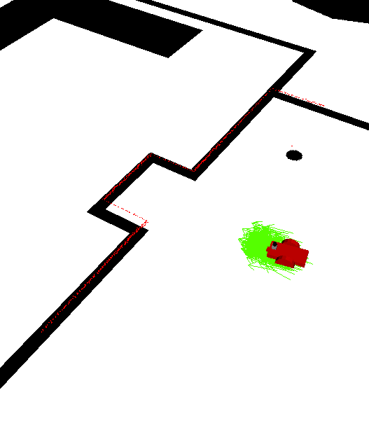

# RoboND - Where Am I
Repository for the third project of the Robotics Software Engineer nanodegree program: Where Am I

In this project, we use Monte-Carlo Localization (MCL), also known as the particle filter, to localize our robot in its environment. We use the ROS AMCL package for this purpose.

Steps for this project:
- [x] Set up simulation environment
- [x] Generate ground truth map from the gazebo world (using `pgm_map_creator` ros package)
- [x] Set up the `amcl` ros package with a launch file and proper localization parameters

The key parameters we have to set for the `amcl` package to work are:
- *odom_model_type*: corrected_diff means we use the `sample_motion_model_odometry` algorithm from Probabilistic Robotics
- *odom_alpha{1 to 4}*: model noise parameters
- *max_particles*: maximum allowed number of particles
- *laser_max_beams*: how many evenly-spaced beams in each scan to be used when updating the filter.

With our current set of parameters the robot quickly manages to locate itself, see the below screenshot:

 

