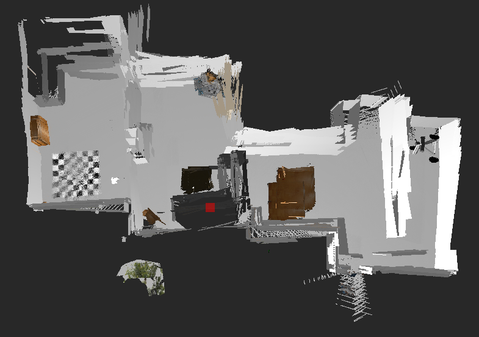
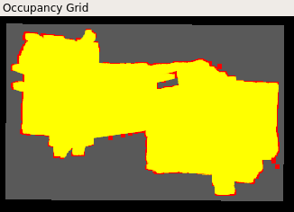

# RoboND - Map My World
Repository for the fourth project of the Robotics Software Engineer nanodegree program: Map My World

In this project, we use a specific implementation of GraphSLAM, RTAB-Map, to simultaneously construct the map of the robot environment and localize it. 

## Project steps:
- [x] Set up the simulation environment
- [x] Ensure that the robot has the necessary sensors for RTAB-Map to work: odometry, laser scan & RGB camera
- [x] Ensure that the world has enough features for GraphSLAM to work properly, it was important to add objects like boxes and pans to the base world
- [x] Perform SLAM: Simulatneous Localization and Mapping

## Running the scripts
- launch the world: `roslaunch my_robot world.launch`
- start the teleop script in order to move the robot around with the keyboard: `rosrun teleop_twist_keyboard teleop_twist_keyboard.py`
- launch the RTAB-Map node: `roslaunch my_robot mapping.launch`

## Results

With our current set of parameters the robot manages to perform SLAM in a pretty efficient way, the below screenshots show the reconstructed 3D map, occupancy grid & graph view from `rtabmap-databaseViewer`:

 

